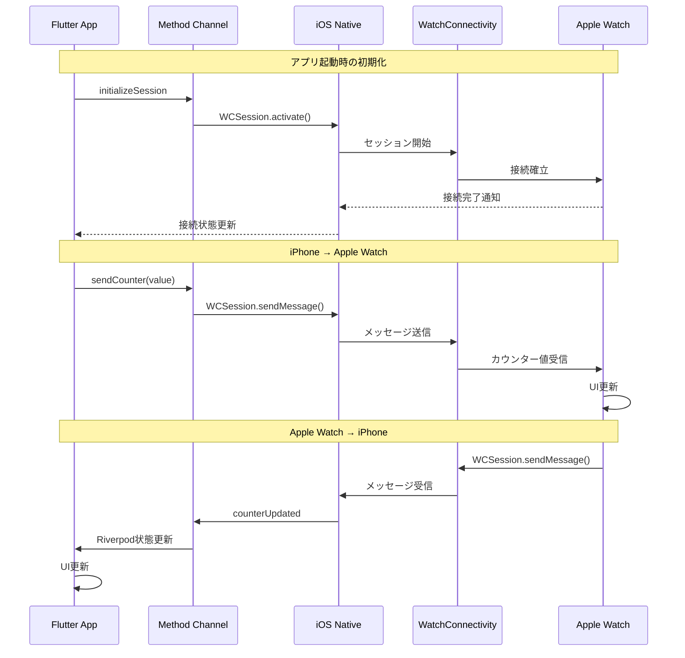

# Flutter ↔ Apple Watch 通信デモ

このプロジェクトは、Flutter アプリと Apple Watch 間でリアルタイムなデータ通信を行うデモアプリケーションです。WatchConnectivity フレームワークと Method Channel を使用して、双方向の通信を実現しています。

## 📱 アプリ概要

シンプルなカウンターアプリを通じて、以下の通信パターンを実装しています：

- **iPhone → Apple Watch**: Flutter アプリでカウンターを操作すると、Apple Watch に同期
- **Apple Watch → iPhone**: Apple Watch でカウンターを操作すると、Flutter アプリに同期
- **接続状態の管理**: リアルタイムな接続状態の表示

## 🔧 技術スタック

### Flutter 側

- **UI Framework**: Flutter (Material Design)
- **状態管理**: Riverpod + riverpod_generator
- **ライフサイクル管理**: flutter_hooks
- **プラットフォーム連携**: Method Channel

### iOS 側

- **通信フレームワーク**: WatchConnectivity
- **アーキテクチャ**: MVVM（Method Channel 統合）
- **言語**: Swift

### watchOS 側

- **UI Framework**: SwiftUI
- **状態管理**: ObservableObject + @Published
- **通信フレームワーク**: WatchConnectivity

## 📁 プロジェクト構造

```
flutter_watch/
├── lib/                          # Flutter アプリケーション
│   ├── main.dart                 # エントリーポイント
│   ├── pages/
│   │   └── counter_page.dart     # カウンターUI
│   ├── providers/               # Riverpod プロバイダー
│   │   ├── counter_provider.dart
│   │   ├── connection_status_provider.dart
│   │   └── watch_communication_service_provider.dart
│   └── models/                  # データモデル
│       ├── watch_connection_status.dart
│       ├── method_channel_method.dart
│       └── watch_status_key.dart
├── ios/                         # iOS ネイティブコード
│   ├── Runner/
│   │   ├── AppDelegate.swift    # Method Channel 統合
│   │   └── WCSessionManager.swift # WatchConnectivity 管理
│   └── FlutterWatch Watch App/  # Apple Watch アプリ
│       ├── FlutterWatchApp.swift
│       ├── ContentView.swift    # Watch UI
│       └── WatchSessionManager.swift # Watch側通信管理
└── docs/                        # 本ドキュメント
    ├── overview/                # 概要説明
    ├── flutter/                 # Flutter実装詳細
    ├── ios/                     # iOS実装詳細
    ├── watchos/                 # watchOS実装詳細
    └── communication/          # 通信フロー詳細
```

## 🚀 主要機能

### 1. リアルタイム同期

- Flutter アプリでカウンターを変更 → Apple Watch に即座に反映
- Apple Watch でカウンターを変更 → Flutter アプリに即座に反映

### 2. 接続状態管理

- Apple Watch との接続状態をリアルタイムで表示
- 接続エラー時の適切なフィードバック

### 3. 型安全な通信

- enum を使用したメソッド名とステータスの管理
- 型安全なデータ通信の実現

## 📋 通信フロー



## 📖 ドキュメント詳細

詳細な実装説明は以下のドキュメントを参照してください：

- [📋 実装概要](./overview/) - アーキテクチャと設計思想
- [🎯 Flutter 実装](./flutter/) - Flutter 側の詳細実装
- [📱 iOS 実装](./ios/) - iOS 側のネイティブ実装
- [⌚ watchOS 実装](./watchos/) - Apple Watch 側の実装
- [🔄 通信フロー](./communication/) - データ通信の詳細解説

## 🎯 学習ポイント

このプロジェクトから学べる内容：

1. **Flutter ↔ Native 通信の基礎**

   - Method Channel の使用方法
   - 双方向通信の実装

2. **WatchConnectivity の活用**

   - WCSession の管理
   - リアルタイム通信の実現

3. **クロスプラットフォーム状態管理**

   - Riverpod を使った状態管理
   - Native ↔ Flutter 間の状態同期

4. **型安全な設計**
   - enum を使った定数管理
   - エラーハンドリングのベストプラクティス
