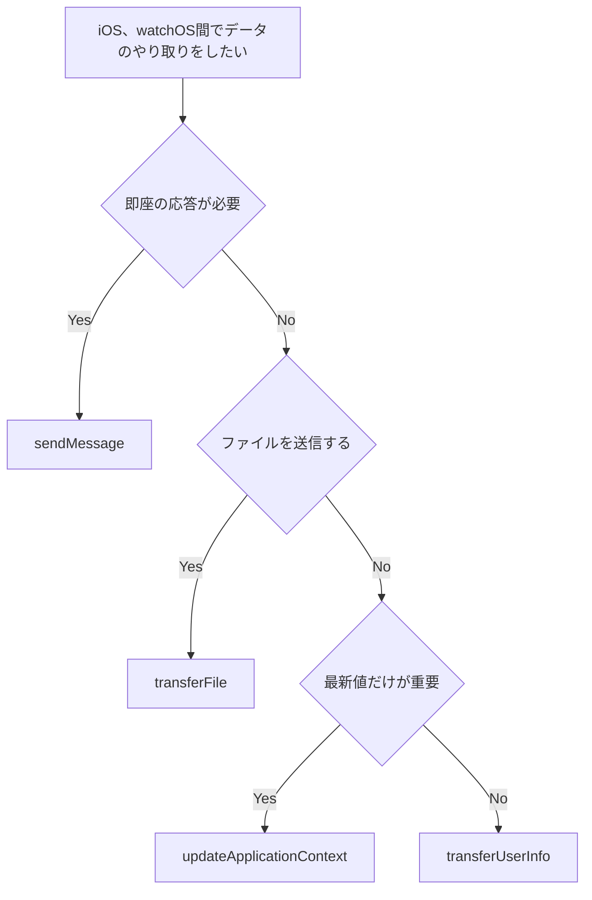

## 初めに
基礎編-2 WCSessionでは、WCSessionに4種類のメソッドが用意されていることを述べました。同章ではそのうちsendMessageのみを用いた通信について実装例を交えて紹介しました。
この章では、紹介できていなかった他のメソッドについて扱い、それぞれのメソッドの特徴や使い分ける際の基準などをまとめてみたいと思います。

また、これ以降の章では各メソッドの使い方について詳しくまとめているので、実際に使用する際には参考にしていただければと思います。

### この章でできるようになること
- WCSession の 4 つのメソッドの違いを理解する
- 用途に応じたメソッドの選択方法を学ぶ
- 各メソッドの実装方法を理解する

## 通信の方法（復習）
WCSessionには送信するデータや即時反映の必要性等に応じて使い分けができます。
以下のようなメソッドが用意されています。
- `sendMessage`
  - 相手デバイスがアクティブで通信可能なときに、即時にメッセージを送る
  - 応答を受け取ることも可能
- `updateApplicationContext`
  - アプリ全体の状態（設定や画面表示に必要な情報など）を共有する
  - 常に最新の内容だけが保持される
- `transferUserInfo`
  - 即時性はないが、必ず配送されるデータを送る
  - 履歴が順番に処理される
- `transferFile`
  - ファイルデータを転送する
  - バックグラウンドでも配送される

## どのメソッドを選ぶべきか
WCSessionには4つのメソッドがありますが、用途に応じて使い分ける必要があります。
オフライン時の挙動や送受信できるデータ容量などの制限もありますが、メソッドを選択する際の主な判断基準をざっくりまとめると以下のようになるかと思います。

### 判断基準


### メソッドの比較
| メソッド                   | 即時性 | 配信保証 | オフライン対応 | 主な用途         |
| -------------------------- | ------ | -------- | -------------- | ---------------- |
| `sendMessage`              | ★★★    | ✩✩✩     | なし           | リアルタイム操作 |
| `updateApplicationContext` | ★★✩   | ★★✩     | あり           | 設定・状態同期   |
| `transferUserInfo`         | ★✩✩  | ★★★      | あり           | 重要データ転送   |
| `transferFile`             | ★✩✩  | ★★★      | あり           | ファイル転送     |

## sendMessage
基礎編-2 WCSessionでも触れましたが、復習も兼ねてsendMessageについてもまとめておきます。

### sendMessage とは何か
`sendMessage`は、WatchConnectivity フレームワークが提供するメソッドの一つで、リアルタイムな双方向通信を実現します。送信と同時に返信を受け取ることで、iOSとwatchOSとの間の遅延を最小限にした動作が可能になります。

### sendMessage の特徴
`sendMessage`には以下のような特徴があります。
- 即座の応答
    - `replyHandler`で結果を即座に受け取ることができる
- 双方向通信
    - 送信と同時に返信を受け取ることができる
- 両デバイスがアクティブである必要がある
    - 両方のデバイスがアクティブ状態でないと動作しない
- 配信が保証ない
    - 失敗したら再送が必要

`sendMessage`は、即座の応答が必要な操作に適しています。例えば、ボタンのタップやリアルタイムな状態の問い合わせなど、ユーザーが待っている操作に使用します。
一方で、オフライン時にも対応したい場合や、確実な配信が必要な場合は、`transferUserInfo`や`updateApplicationContext`を検討する必要があります。

### sendMessage が適している場面
- ボタンのタップなど、即座のフィードバックが必要な操作
- リアルタイムな状態の問い合わせ
- ユーザーが待っている操作
- 双方向通信が必要な場面

### 実装方法
#### iOS側の実装
WCSessionを使用するためには、iPhoneとApple Watchとの通信を開始する前にセッションの初期化を行う必要があります。
以下のように `WCSession.isSupported`を確認したり、`session.activate()`を行う必要があります。
```swift
class WCSessionManager: NSObject {
    static let shared = WCSessionManager()
    private var counter: Int = 0
    private let session = WCSession.default
    private var flutterApi: CounterFlutterApi?

    private override init() {
        super.init()

        guard WCSession.isSupported() else {
            return
        }

        session.delegate = self
        session.activate()
    }
}
```

`session`の`didReceiveMessage`でwatchOS側からメッセージを受け取った際の挙動を定義できます。watchOS側からアクションの名前と値を渡すことで、それぞれのアクションに応じた挙動を実現できます。
また、iOS側でメッセージを受け取った後の挙動を`replyHandler`で定義することができます。
これでwatchOS側に即座にメッセージを送信することができます。
```swift
extension WCSessionManager: WCSessionDelegate {
    func session(
        _ session: WCSession,
        didReceiveMessage message: [String : Any],
        replyHandler: @escaping ([String : Any]) -> Void
    ) {
        guard let action = message["action"] as? String else {
            replyHandler(["error": "Invalid message format"])
            return
        }

        switch action {
        case "increment":
            counter += 1
            notifyFlutter(counter: counter)

            let reply: [String: Any] = [
                "count": counter,
                "timestamp": Date().timeIntervalSince1970
            ]
            replyHandler(reply)

        case "decrement":
            ...
        default:
            replyHandler(["error": "Unknown action: \(action)"])
        }
    }
}
```

なお、`didReceiveMessage`メソッドには以下の2つのバリエーションがあります。
- `didReceiveMessage(_:replyHandler:)`
- `didReceiveMessage(_:)`

前者はメッセージを受け取った際の返信が必要な場合に使用し、後者は返信が不要な場合に使用します。前者は先述の例の通り`replyHandler`を呼び出すことで、送信元に返信を送ることができます。

#### watchOS側の実装
watchOS側でもそれぞれ処理を定義する必要があります。
以下のコードでは、iOS側にカウンターの値を送信しています。
`session.sendMessage`でメッセージを送信し、`replyHandler`や`errorHandler`でメッセージが届いた後の処理を記述できます。
```swift
class WatchSessionManager: NSObject, ObservableObject {
    @Published var count: Int = 0
    @Published var isReachable: Bool = false
    private let session = WCSession.default
    private var isSending: Bool = false

    func incrementCounter() {
        guard !isSending else {
            return
        }

        guard session.isReachable else {
            return
        }

        isSending = true
        let previousCount = count
        count += 1

        let message: [String: Any] = [
            "action": "increment",
            "timestamp": Date().timeIntervalSince1970
        ]

        session.sendMessage(
            message,
            replyHandler: { [weak self] reply in
                DispatchQueue.main.async {
                    self?.handleReply(reply)
                }
            },
            errorHandler: { [weak self] error in
                DispatchQueue.main.async {
                    guard let self = self else { return }
                    self.count = previousCount  // ロールバック
                    self.handleError(error)
                }
            }
        )
    }
}
```

以下ではiOS側から送信されたメッセージを受信する処理を実装しています。
`message["counter"]`からカウンターの値を取得し、`@Published`プロパティの`count`を更新することで、UIが更新されます。
`DispatchQueue.main.async`でメインスレッドでの更新を保証しています。
```swift
func session(
    _ session: WCSession,
    didReceiveMessage message: [String : Any],
    replyHandler: @escaping ([String : Any]) -> Void
) {
    DispatchQueue.main.async {
        if let counterValue = message["counter"] as? Int {
            self.count = counterValue
        }
    }

    let reply: [String: Any] = [
        "status": "received",
        "count": count
    ]
    replyHandler(reply)
}
```

## updateApplicationContext
### updateApplicationContext とは何か
`updateApplicationContext`は、WatchConnectivity フレームワークが提供するメソッドの一つで、最新の状態（コンテキスト）を同期します。このメソッドで複数回連続でデータを送信すると古いデータは自動的に上書きされ、最後の値のみが送信されます。したがって常に最新のデータのみが保持されます。

### updateApplicationContext の特徴
`updateApplicationContext`には以下のような特徴があります。

- 最新データのみ保持
  - 連続して送信すると、古いデータは自動的に破棄され、最後の値のみが送信される
- バックグラウンド動作
  - アプリが非アクティブでも動作し、次回起動時に最新設定が反映される
- 自動配信
  - システムが適切なタイミングで配信するため、即座の配信は保証されない
- 到達可能性のチェック不要
  - `sendMessage`と違い、`isReachable`のチェックが不要

`updateApplicationContext`は、設定値など、最新値だけが重要なデータの同期に適しています。例えば、テーマカラーやフォントサイズなどの設定を、iPhone と Apple Watch 間で同期する場合に使用します。

一方で、即座の応答が必要な操作や、確実な配信が必要な場合は、`sendMessage`や`transferUserInfo`を検討、使用する必要があるかと思います。

### updateApplicationContext が適している場面
- アプリの設定値の同期（テーマカラー、フォントサイズなど）
- 現在の状態の共有
- 頻繁に更新されるが、最新値だけが重要なデータ
- バックグラウンドでも同期したい設定

### 実装方法
#### iOS 側の実装
WCSession を使用するためには、iPhone と Apple Watch との通信を開始する前にセッションの初期化を行う必要があります。
以下のように `WCSession.isSupported`を確認したり、`session.activate()`を行う必要があります。
```swift
class WCSessionManager: NSObject {
    static let shared = WCSessionManager()
    private let session = WCSession.default
    private var flutterApi: SettingsFlutterApi?

    private override init() {
        super.init()

        guard WCSession.isSupported() else {
            return
        }

        session.delegate = self
        session.activate()
    }
}
```

`updateApplicationContext`で設定を送信する処理を実装します。
`sendMessage`と違い、`isReachable`のチェックは不要です。また、連続して送信すると、古いデータは自動的に上書きされ、最後の値のみが送信されます。
```swift
func updateSettings(settings: SettingsData) throws {
    saveSettings(settings)

    let context: [String: Any] = [
        "color": settings.color,
        "fontSize": settings.fontSize,
        "notificationEnabled": settings.notificationEnabled,
        "lastUpdated": settings.lastUpdated
    ]

    do {
        try session.updateApplicationContext(context)
    } catch {
        print("Failed to update application context: \(error)")
        throw error
    }
}
```

`session`の`didReceiveApplicationContext`で watchOS 側から設定を受け取った際の挙動を定義できます。
このメソッドは、アプリがバックグラウンドにある場合でも呼ばれる可能性があります。
```swift
extension WCSessionManager: WCSessionDelegate {
    func session(
        _ session: WCSession,
        didReceiveApplicationContext applicationContext: [String : Any]
    ) {
        guard let color = applicationContext["color"] as? Int,
              let fontSize = applicationContext["fontSize"] as? Int,
              let notificationEnabled = applicationContext["notificationEnabled"] as? Bool,
              let lastUpdated = applicationContext["lastUpdated"] as? Double else {
            print("Invalid context format")
            return
        }

        let settings = SettingsData(
            color: Int64(color),
            fontSize: Int64(fontSize),
            notificationEnabled: notificationEnabled,
            lastUpdated: lastUpdated
        )
        saveSettings(settings)
        notifyFlutter(settings: settings)
    }
}
```

#### watchOS 側の実装
watchOS 側でもそれぞれ処理を定義する必要があります。
以下のコードでは、iOS 側に設定を送信しています。
`session.updateApplicationContext`で設定を送信します。`sendMessage`と異なり、`replyHandler`や`errorHandler`でメッセージが到達した際の挙動を定義することはできません。
```swift
class WatchSessionManager: NSObject, ObservableObject {
    @Published var color: Int = 1
    @Published var fontSize: Int = 1
    @Published var notificationEnabled: Bool = true
    @Published var lastUpdated: Date = Date()
    private let session = WCSession.default

    func updateSettings() {
        saveSettings()

        let context: [String: Any] = [
            "color": color,
            "fontSize": fontSize,
            "notificationEnabled": notificationEnabled,
            "lastUpdated": lastUpdated.timeIntervalSince1970
        ]

        do {
            try session.updateApplicationContext(context)
        } catch {
            print("Failed to update application context: \(error)")
        }
    }
}
```

以下では iOS 側から送信された設定を受信する処理を実装しています。
`applicationContext`から設定の値を取得し、`@Published`プロパティを更新することで、UI が更新されます。
`DispatchQueue.main.async`でメインスレッドでの更新を保証しています。
```swift
func session(
    _ session: WCSession,
    didReceiveApplicationContext applicationContext: [String : Any]
) {
    guard let color = applicationContext["color"] as? Int,
          let fontSize = applicationContext["fontSize"] as? Int,
          let notificationEnabled = applicationContext["notificationEnabled"] as? Bool,
          let lastUpdated = applicationContext["lastUpdated"] as? Double else {
        return
    }

    DispatchQueue.main.async {
        self.color = color
        self.fontSize = fontSize
        self.notificationEnabled = notificationEnabled
        self.lastUpdated = Date(timeIntervalSince1970: lastUpdated)
        self.saveSettings()
    }
}
```

## transferUserInfo
### transferUserInfo とは何か
`transferUserInfo`は、WatchConnectivity フレームワークが提供するメソッドの一つで、重要データを確実に転送します。このメソッドの最大の特徴は、すべてのメッセージがキューに保持され、送信順序が保証されることです。オフライン時でもキューに追加され、接続が回復したら自動的に配信されます。

### transferUserInfo の特徴
`transferUserInfo`には以下のような特徴があります。

- すべてのメッセージがキューに保持される
  - `updateApplicationContext`と異なり、最新値だけでなく、すべてのメッセージが順番に配信される
- 送信順序が保証される
  - 送信した順番通りに受信側で処理される
- オフライン時も動作
  - オフライン時でもキューに追加され、接続回復後に自動的に配信される
- 到達可能性のチェック不要
  - `sendMessage`と違い、`isReachable`のチェックが不要
- キュー状態の管理
  - `outstandingUserInfoTransfers`でキューに残っているメッセージ数を確認できる

`transferUserInfo`は、すべてのメッセージを確実に配信したい場合に適しています。例えば、メッセージアプリで送信したメッセージをすべて確実に配信したい場合に使用します。

一方で、即座の応答が必要な操作には`sendMessage`を、最新値だけが重要な設定の同期には`updateApplicationContext`を使用する必要があるかと思います。

### transferUserInfo が適している場面
- すべてのメッセージを確実に配信したい場合
- 送信順序が重要なデータ転送
- オフライン時でも後から配信したいデータ
- 重要データの転送（メッセージ、ログ、イベントなど）

### 実装方法
#### iOS 側の実装
WCSession を使用するためには、iPhone と Apple Watch との通信を開始する前にセッションの初期化を行う必要があります。
以下のように `WCSession.isSupported`を確認したり、`session.activate()`を行う必要があります。
```swift
class WCSessionManager: NSObject {
    static let shared = WCSessionManager()
    private let session = WCSession.default
    private var flutterApi: MessageFlutterApi?

    private override init() {
        super.init()

        guard WCSession.isSupported() else {
            return
        }

        session.delegate = self
        session.activate()
    }
}
```

`transferUserInfo`でメッセージを送信する処理を実装します。
`sendMessage`と違い、`isReachable`のチェックは不要です。また、すべてのメッセージがキューに保持され、順番に配信されます。
```swift
func sendMessage(message: MessageData) throws {
    saveSentMessage(message)
    let userInfo: [String: Any] = [
        "type": "message",
        "id": message.id,
        "text": message.text,
        "sender": message.sender,
        "timestamp": message.timestamp,
        "isRead": message.isRead
    ]

    session.transferUserInfo(userInfo)
    notifyQueueStatus()
}
```

キュー状態を取得する処理を実装します。
`outstandingUserInfoTransfers`でキューに残っているメッセージ数を確認できます。
```swift
func getQueueStatus() -> QueueStatus {
    let transfers = session.outstandingUserInfoTransfers
    let isTransferring = transfers.contains { $0.isTransferring }

    return QueueStatus(
        outstandingCount: Int64(transfers.count),
        isTransferring: isTransferring
    )
}
```

以下では特定のメッセージの転送をキャンセルする処理を実装しています。
`outstandingUserInfoTransfers`から該当するメッセージを見つけて、`cancel()`を呼び出します。
```swift
func cancelMessage(messageId: String) -> Bool {
    for transfer in session.outstandingUserInfoTransfers {
        if let id = transfer.userInfo["id"] as? String, id == messageId {
            transfer.cancel()
            notifyQueueStatus()
            return true
        }
    }

    return false
}
```

`session`の`didReceiveUserInfo`で watchOS 側からメッセージを受け取った際の挙動を定義できます。
このメソッドは、アプリがバックグラウンドにある場合でも呼ばれる可能性があります。
```swift
extension WCSessionManager: WCSessionDelegate {
    func session(
        _ session: WCSession,
        didReceiveUserInfo userInfo: [String : Any] = [:]
    ) {
        guard let type = userInfo["type"] as? String, type == "message" else {
            print("Invalid message type")
            return
        }

        guard let id = userInfo["id"] as? String,
              let text = userInfo["text"] as? String,
              let sender = userInfo["sender"] as? String,
              let timestamp = userInfo["timestamp"] as? Double,
              let isRead = userInfo["isRead"] as? Bool else {
            print("Invalid message format")
            return
        }

        let receivedIds = getReceivedMessageIds()
        if receivedIds.contains(id) {
            return
        }

        let message = MessageData(
            id: id,
            text: text,
            sender: sender,
            timestamp: timestamp,
            isRead: isRead
        )
        var messages = loadReceivedMessages()
        messages.append(message)
        saveReceivedMessages(messages)
        addReceivedMessageId(id)
        notifyFlutter(message: message)
    }
}
```

#### watchOS 側の実装
watchOS 側でもそれぞれ処理を定義する必要があります。
以下のコードでは、iOS 側にメッセージを送信しています。
`session.transferUserInfo`でメッセージを送信します。`sendMessage`と異なり、`replyHandler`や`errorHandler`でメッセージが到達した際の挙動を定義することはできません。
```swift
class WatchSessionManager: NSObject, ObservableObject {
    @Published var sentMessages: [WatchMessage] = []
    @Published var receivedMessages: [WatchMessage] = []
    @Published var isReachable: Bool = false
    @Published var outstandingCount: Int = 0
    private let session = WCSession.default

    func sendMessage(text: String) {
        let message = WatchMessage(
            id: UUID().uuidString,
            text: text,
            sender: "Watch",
            timestamp: Date().timeIntervalSince1970,
            isRead: false
        )

        sentMessages.append(message)
        saveSentMessages()
        let userInfo: [String: Any] = [
            "type": "message",
            "id": message.id,
            "text": message.text,
            "sender": message.sender,
            "timestamp": message.timestamp,
            "isRead": message.isRead
        ]

        session.transferUserInfo(userInfo)
        updateQueueStatus()
    }
}
```

以下では iOS 側から送信されたメッセージを受信する処理を実装しています。
`userInfo`からメッセージの値を取得し、`@Published`プロパティを更新することで、UI が更新されます。
`DispatchQueue.main.async`でメインスレッドでの更新を保証しています。
```swift
func session(
    _ session: WCSession,
    didReceiveUserInfo userInfo: [String : Any]
) {
    guard let type = userInfo["type"] as? String, type == "message" else {
        return
    }

    guard let id = userInfo["id"] as? String,
          let text = userInfo["text"] as? String,
          let sender = userInfo["sender"] as? String,
          let timestamp = userInfo["timestamp"] as? Double,
          let isRead = userInfo["isRead"] as? Bool else {
        print("Invalid message format")
        return
    }

    let receivedIds = getReceivedMessageIds()
    if receivedIds.contains(id) {
        return
    }

    let message = WatchMessage(
        id: id,
        text: text,
        sender: sender,
        timestamp: timestamp,
        isRead: isRead
    )

    DispatchQueue.main.async {
        self.receivedMessages.append(message)
        self.saveReceivedMessages()
        self.addReceivedMessageId(id)
    }
}
```

`transferUserInfo`は、すべてのメッセージを確実に配信したい場合に適しています。一方で、即座の応答が必要な操作には`sendMessage`を、最新値だけが重要な設定の同期には`updateApplicationContext`を使用する必要があるかと思います。

## transferFile
### transferFile とは何か
`transferFile`は、WatchConnectivity フレームワークが提供するメソッドの一つで、ファイルを確実に転送します。このメソッドの最大の特徴は、ファイル転送専用であり、進捗状況を監視できることです。オフライン時でもキューに追加され、接続が回復したら自動的に配信されます。

### transferFile の特徴
`transferFile`には以下のような特徴があります。

- ファイル転送専用
  - テキストデータや辞書型データではなく、ファイル（画像、動画、ドキュメントなど）を転送するために設計されている
- 進捗監視が可能
  - `WCSessionFileTransfer.progress`で転送進捗を監視できる
  - `fractionCompleted`で進捗率（0.0〜1.0）を取得できる
  - `completedUnitCount`と`totalUnitCount`で転送済み/総バイト数を取得できる
- すべてのファイルがキューに保持される
  - `transferUserInfo`と同様に、すべてのファイルが順番に配信される
- 送信順序が保証される
  - 送信した順番通りに受信側で処理される
- オフライン時も動作
  - オフライン時でもキューに追加され、接続回復後に自動的に配信される
- 到達可能性のチェック不要
  - `sendMessage`と違い、`isReachable`のチェックが不要
- メタデータの送信
  - ファイルと一緒にメタデータ（辞書型）を送信できる
- キュー状態の管理
  - `outstandingFileTransfers`でキューに残っているファイル数を確認できる

`transferFile`は、画像や動画などのファイルを確実に転送したい場合に適しています。例えば、写真アプリで撮影した画像をApple Watchに転送したい場合に使用します。

一方で、テキストデータの転送には`transferUserInfo`を、即座の応答が必要な操作には`sendMessage`を、最新値だけが重要な設定の同期には`updateApplicationContext`を使用する必要があるかと思います。

### transferFile が適している場面
- 画像や動画などのファイルを転送したい場合
- ファイルの転送進捗を表示したい場合
- すべてのファイルを確実に配信したい場合
- 送信順序が重要なファイル転送
- オフライン時でも後から配信したいファイル

### 実装方法
#### iOS 側の実装
WCSession を使用するためには、iPhone と Apple Watch との通信を開始する前にセッションの初期化を行う必要があります。
以下のように `WCSession.isSupported`を確認したり、`session.activate()`を行う必要があります。
```swift
class ImageTransferWCSessionManager: NSObject {
    static let shared = ImageTransferWCSessionManager()
    private let session = WCSession.default
    private var flutterApi: ImageTransferFlutterApi?

    private override init() {
        super.init()

        guard WCSession.isSupported() else {
            return
        }

        session.delegate = self
        session.activate()
    }
}
```

`transferFile`でファイルを送信する処理を実装します。
まず、画像データを一時ファイルとして保存し、メタデータと一緒に転送します。
```swift
func transferImage(imageData: FlutterStandardTypedData, metadata: ImageMetadata) throws {
    // 一時ファイルとして保存
    let tempURL = FileManager.default.temporaryDirectory
        .appendingPathComponent(metadata.id)
        .appendingPathExtension("jpg")

    do {
        try imageData.data.write(to: tempURL)
    } catch {
        print("Failed to write temp file: \(error)")
        throw error
    }

    // メタデータを辞書型で作成
    let metadataDict: [String: Any] = [
        "id": metadata.id,
        "fileName": metadata.fileName,
        "fileSize": metadata.fileSize,
        "width": metadata.width,
        "height": metadata.height,
        "timestamp": metadata.timestamp
    ]

    // 転送履歴に追加（pending状態）
    addToHistory(metadata: metadata, status: 0) // 0 = pending

    // ファイルを転送（メタデータと一緒に）
    let transfer = session.transferFile(tempURL, metadata: metadataDict)

    // 進捗監視を開始
    startMonitoringProgress(transfer: transfer, imageId: metadata.id)
}
```

以下では転送進捗を監視する処理を実装しています。
`WCSessionFileTransfer.progress`の`fractionCompleted`を監視することで、転送進捗を取得できます。
```swift
private func startMonitoringProgress(transfer: WCSessionFileTransfer, imageId: String) {
    transferStartTimes[imageId] = Date()
    lastProgressValues[imageId] = 0.0

    let observation = transfer.progress.observe(\.fractionCompleted, options: [.new]) { [weak self] progress, _ in
        guard let self = self else { return }

        DispatchQueue.main.async {
            let progressData = self.calculateProgress(
                transfer: transfer,
                imageId: imageId
            )
            self.notifyProgress(progressData)
            self.lastProgressValues[imageId] = progress.fractionCompleted
        }
    }

    progressObservations[imageId] = observation

    // 定期的に進捗を更新するタイマーを開始
    if progressTimer == nil {
        progressTimer = Timer.scheduledTimer(withTimeInterval: 0.5, repeats: true) { [weak self] _ in
            self?.updateAllProgress()
        }
    }
}
```

転送進捗を計算する処理を実装します。
転送速度や残り時間も計算できます。
```swift
private func calculateProgress(
    transfer: WCSessionFileTransfer,
    imageId: String
) -> TransferProgress {
    let progress = transfer.progress.fractionCompleted
    let completedBytes = transfer.progress.completedUnitCount
    let totalBytes = transfer.progress.totalUnitCount

    var transferSpeed: Double = 0.0
    var estimatedTimeRemaining: Double = 0.0

    if let startTime = transferStartTimes[imageId] {
        let elapsedTime = Date().timeIntervalSince(startTime)
        if elapsedTime > 0 {
            // 転送速度を計算（bytes/sec）
            transferSpeed = Double(completedBytes) / elapsedTime

            // 残り時間を計算
            let remainingBytes = totalBytes - completedBytes
            if transferSpeed > 0 {
                estimatedTimeRemaining = Double(remainingBytes) / transferSpeed
            }
        }
    }

    return TransferProgress(
        imageId: imageId,
        progress: progress,
        bytesTransferred: completedBytes,
        totalBytes: totalBytes,
        transferSpeed: transferSpeed,
        estimatedTimeRemaining: max(0, estimatedTimeRemaining)
    )
}
```

進行中の転送一覧を取得する処理を実装します。
`outstandingFileTransfers`でキューに残っているファイル転送を確認できます。
```swift
func getActiveTransfers() -> [TransferProgress] {
    var activeTransfers: [TransferProgress] = []

    for transfer in session.outstandingFileTransfers {
        guard let imageId = transfer.file.metadata?["id"] as? String else {
            continue
        }

        let progress = calculateProgress(
            transfer: transfer,
            imageId: imageId
        )
        activeTransfers.append(progress)
    }

    return activeTransfers
}
```

特定のファイルの転送をキャンセルする処理を実装します。
`outstandingFileTransfers`から該当するファイルを見つけて、`cancel()`を呼び出します。
```swift
func cancelTransfer(imageId: String) {
    for transfer in session.outstandingFileTransfers {
        if let id = transfer.file.metadata?["id"] as? String, id == imageId {
            transfer.cancel()
            stopMonitoringProgress(imageId: imageId)
            updateHistoryStatus(imageId: imageId, status: 4) // 4 = cancelled
            return
        }
    }
}
```

`session`の`didFinish fileTransfer:error:`で転送完了時の挙動を定義できます。
このメソッドは、転送が成功または失敗した際に呼ばれます。
```swift
extension ImageTransferWCSessionManager: WCSessionDelegate {
    func session(
        _ session: WCSession,
        didFinish fileTransfer: WCSessionFileTransfer,
        error: Error?
    ) {
        guard let imageId = fileTransfer.file.metadata?["id"] as? String else {
            print("No imageId in transfer metadata")
            return
        }

        stopMonitoringProgress(imageId: imageId)

        if let error = error {
            print("Error: \(error.localizedDescription)")
            // 転送失敗として記録
            updateHistoryStatus(imageId: imageId, status: 3) // 3 = failed
            flutterApi?.onTransferFailed(imageId: imageId, error: error.localizedDescription) { _ in }
        } else {
            // 転送成功として記録
            let completedAt = Date().timeIntervalSince1970
            updateHistoryStatus(imageId: imageId, status: 2, completedAt: completedAt) // 2 = completed
            flutterApi?.onTransferCompleted(imageId: imageId) { _ in }
        }
    }
}
```

#### watchOS 側の実装
watchOS 側でもそれぞれ処理を定義する必要があります。
以下のコードでは、iOS 側から送信されたファイルを受信しています。
`session`の`didReceive file:`でファイルを受信できます。
```swift
class ImageWatchSessionManager: NSObject, ObservableObject {
    static let shared = ImageWatchSessionManager()
    private let session = WCSession.default

    @Published var images: [WatchImage] = []
    @Published var isReachable: Bool = false

    private override init() {
        super.init()

        guard WCSession.isSupported() else {
            return
        }

        loadImagesMetadata()

        session.delegate = self
        session.activate()
    }
}
```

以下では iOS 側から送信されたファイルを受信する処理を実装しています。
`file.fileURL`からファイルの一時的な場所を取得し、`file.metadata`からメタデータを取得できます。
受信したファイルは適切な場所に移動する必要があります。
```swift
extension ImageWatchSessionManager: WCSessionDelegate {
    func session(_ session: WCSession, didReceive file: WCSessionFile) {
        guard let metadata = file.metadata,
              let id = metadata["id"] as? String,
              let fileName = metadata["fileName"] as? String,
              let fileSize = metadata["fileSize"] as? Int,
              let width = metadata["width"] as? Int,
              let height = metadata["height"] as? Int,
              let timestamp = metadata["timestamp"] as? Double else {
            print("Invalid metadata")
            return
        }

        // ドキュメントディレクトリに保存
        let documentsURL = FileManager.default.urls(
            for: .documentDirectory,
            in: .userDomainMask
        )[0]

        let destinationURL = documentsURL
            .appendingPathComponent(id)
            .appendingPathExtension("jpg")

        do {
            // 既存のファイルがあれば削除
            if FileManager.default.fileExists(atPath: destinationURL.path) {
                try FileManager.default.removeItem(at: destinationURL)
            }

            // 一時ファイルを永続的な場所に移動
            try FileManager.default.moveItem(
                at: file.fileURL,
                to: destinationURL
            )

            let watchImage = WatchImage(
                id: id,
                fileName: fileName,
                fileSize: fileSize,
                width: width,
                height: height,
                timestamp: Date(timeIntervalSince1970: timestamp),
                fileURL: destinationURL
            )

            DispatchQueue.main.async {
                self.addImage(watchImage)
            }

        } catch {
            print("Failed to save file: \(error)")
        }
    }
}
```

`transferFile`は、画像や動画などのファイルを確実に転送したい場合に適しています。一方で、テキストデータの転送には`transferUserInfo`を、即座の応答が必要な操作には`sendMessage`を、最新値だけが重要な設定の同期には`updateApplicationContext`を使用する必要があるかと思います。
