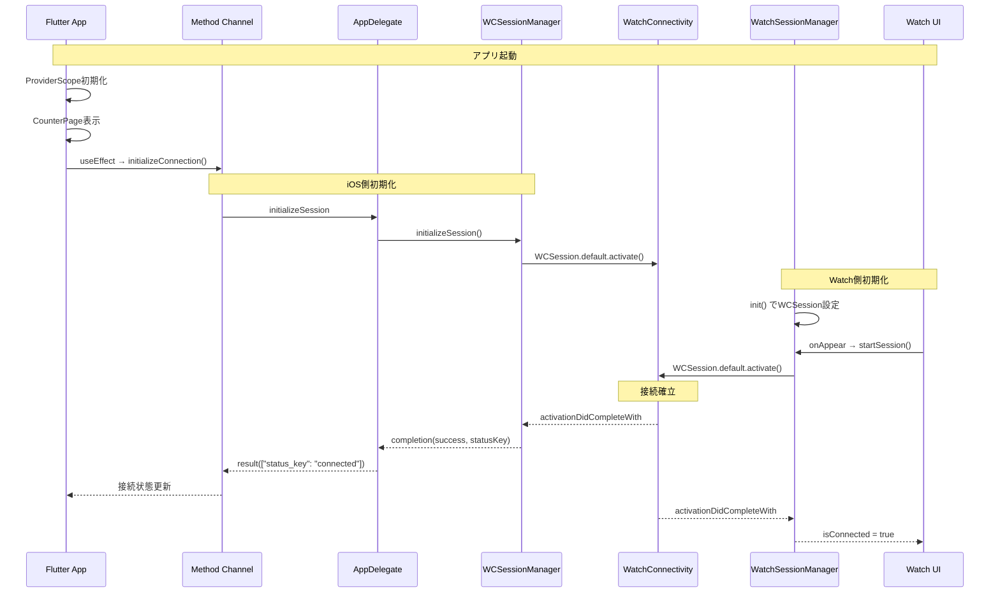
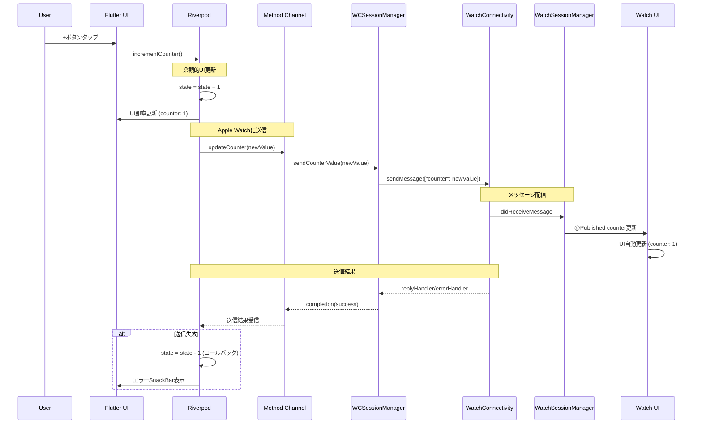
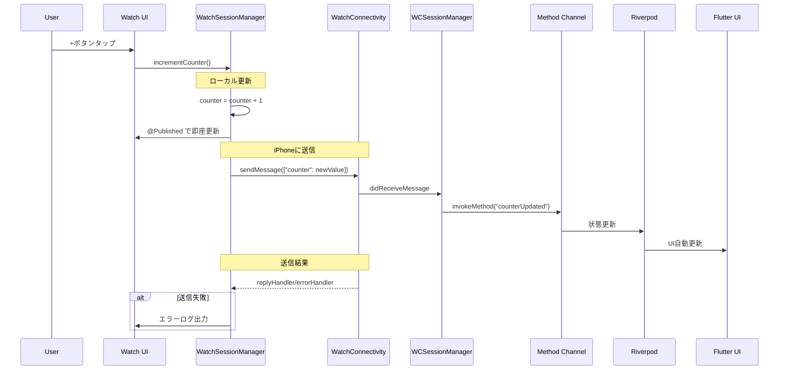
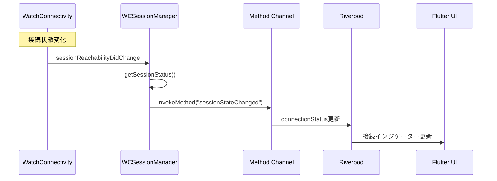
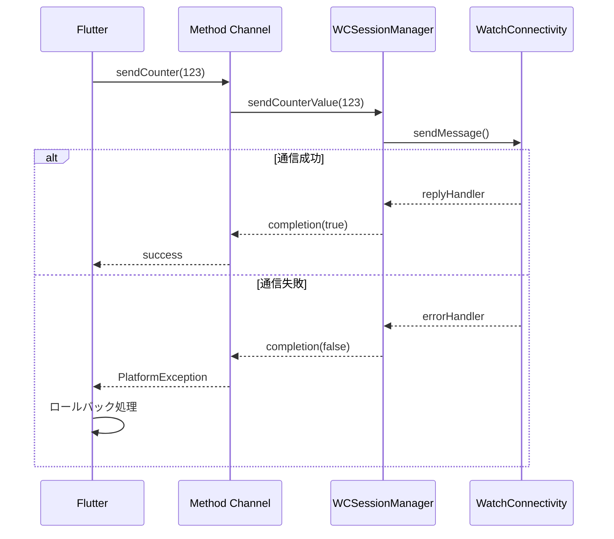

# 通信フロー詳細

Flutter、iOS、watchOS 間の複雑な通信フローについて、シーケンス図とサンプルコードを使って詳細に解説します。

## 🔄 通信アーキテクチャ

```
┌─────────────────┐    ┌─────────────────┐    ┌─────────────────┐
│   Flutter App   │    │   iOS Native    │    │  watchOS App    │
│                 │    │                 │    │                 │
│ ┌─────────────┐ │    │ ┌─────────────┐ │    │ ┌─────────────┐ │
│ │  Riverpod   │ │    │ │WCSession    │ │    │ │  SwiftUI    │ │
│ │  Provider   │◄┼────┼►│Manager      │◄┼────┼►│   Views     │ │
│ └─────────────┘ │    │ └─────────────┘ │    │ └─────────────┘ │
│ ┌─────────────┐ │    │ ┌─────────────┐ │    │ ┌─────────────┐ │
│ │Method       │ │    │ │App          │ │    │ │Watch        │ │
│ │Channel      │◄┼────┼►│Delegate     │ │    │ │Session      │ │
│ └─────────────┘ │    │ └─────────────┘ │    │ │Manager      │ │
└─────────────────┘    └─────────────────┘    │ └─────────────┘ │
                                              └─────────────────┘
```

## 🚀 初期化フロー

### 1. アプリ起動時の初期化



### 2. 初期化シーケンスのコード

**Flutter 側:**

```dart
// useEffectで初期化
useEffect(() {
  watchService.initializeConnection();
  return null;
}, []);

// 初期化処理
Future<void> initializeConnection() async {
  try {
    final result = await platformChannel.invokeMethod('initializeSession');
    final statusKey = result['status_key'] ?? 'error';
    final status = _parseConnectionStatus(statusKey);
    _ref.read(connectionStatusProvider.notifier).update(status);
  } on PlatformException {
    _ref
        .read(connectionStatusProvider.notifier)
        .update(WatchConnectionStatus.error);
  }
}
```

**iOS 側:**

```swift
// AppDelegate
case "initializeSession":
  wcSessionManager?.initializeSession { success, statusKey in
    DispatchQueue.main.async {
      result(["status_key": statusKey])
    }
  }

// WCSessionManager
func initializeSession(completion: @escaping (Bool, String) -> Void) {
    guard WCSession.isSupported() else {
        completion(false, "WCSession is not supported")
        return
    }

    wcSession = WCSession.default
    wcSession?.delegate = self
    wcSession?.activate()

    // 初期化完了後の状態チェック
    DispatchQueue.main.asyncAfter(deadline: .now() + 1.0) { [weak self] in
        guard let session = self?.wcSession else {
            completion(false, "Session is nil after activation")
            return
        }
        let status = self?.getSessionStatus(session) ?? "error"
        completion(session.isReachable, status)
    }
}
```

**watchOS 側:**

```swift
// ContentView
.onAppear {
    sessionManager.startSession()
}

// WatchSessionManager
func startSession() {
    wcSession?.activate()

    DispatchQueue.main.asyncAfter(deadline: .now() + 1.0) {
        self.checkSessionState()
    }
}
```

## 📱 iPhone → Apple Watch 通信

### 1. フロー概要



### 2. 実装コード詳細

**Flutter 側:**

```dart
// カウンター増加処理
Future<void> incrementCounter() async {
  try {
    // 1. まずローカル状態を更新（即座のUI反映）
    ref.read(counterProvider.notifier).increment();
    final newValue = ref.read(counterProvider);

    // 2. Apple Watchに送信
    await watchService.updateCounter(newValue);
  } on PlatformException catch (e) {
    // 3. エラー時は元の値に戻す（ロールバック）
    ref.read(counterProvider.notifier).decrement();
    if (context.mounted) {
      ScaffoldMessenger.of(context).showSnackBar(
        SnackBar(content: Text('送信エラー: ${e.message}')),
      );
    }
  }
}

// Watch通信サービス
Future<bool> updateCounter(int newValue) async {
  try {
    debugPrint('📱 iPhone → Watch: $newValue');
    final success = await platformChannel.invokeMethod('sendCounter', {
      'counter': newValue,
    });
    return success == true;
  } on PlatformException catch (e) {
    debugPrint('📱 Send error: ${e.message}');
    rethrow;
  }
}
```

**iOS 側:**

```swift
// AppDelegate
case "sendCounter":
  guard let args = call.arguments as? [String: Any],
        let counter = args["counter"] as? Int else {
    result(FlutterError(code: "INVALID_ARGUMENT", message: "Invalid counter value", details: nil))
    return
  }

  wcSessionManager?.sendCounterValue(counter) { success in
    DispatchQueue.main.async {
      result(success)
    }
  }

// WCSessionManager
func sendCounterValue(_ counter: Int, completion: @escaping (Bool) -> Void) {
    guard let session = wcSession,
          session.isReachable else {
        completion(false)
        return
    }

    let message = ["counter": counter]
    session.sendMessage(message, replyHandler: { response in
        completion(true)
    }, errorHandler: { error in
        completion(false)
    })
}
```

**watchOS 側:**

```swift
// WatchSessionManager
func session(_ session: WCSession, didReceiveMessage message: [String : Any], replyHandler: @escaping ([String : Any]) -> Void) {
    DispatchQueue.main.async {
        if let counterValue = message["counter"] as? Int {
            print("⌚️ iPhone → Watch: \(counterValue)")
            self.counter = counterValue  // @Published で自動UI更新
        }

        // 応答を送信
        let reply = ["status": "received"] as [String : Any]
        replyHandler(reply)
    }
}
```

## ⌚ Apple Watch → iPhone 通信

### 1. フロー概要



### 2. 実装コード詳細

**watchOS 側:**

```swift
// ユーザー操作
func incrementCounter() {
    let newValue = counter + 1
    updateCounter(newValue)
}

private func updateCounter(_ newValue: Int) {
    // 1. ローカル状態を即座に更新
    counter = newValue  // @Published で自動UI更新

    // 2. iPhoneに送信
    sendCounterToiPhone(newValue)
}

private func sendCounterToiPhone(_ value: Int) {
    guard let session = wcSession,
          session.isReachable else {
        print("⌚️ iPhone not reachable")
        return
    }

    let message = ["counter": value]
    print("⌚️ Watch → iPhone: \(value)")
    session.sendMessage(message, replyHandler: { _ in
        // 成功
    }, errorHandler: { error in
        print("⌚️ Send error: \(error.localizedDescription)")
    })
}
```

**iOS 側:**

```swift
// WCSessionManager - メッセージ受信
func session(_ session: WCSession, didReceiveMessage message: [String : Any]) {
    DispatchQueue.main.async {
        if let counter = message["counter"] as? Int {
            self.methodChannel.invokeMethod("counterUpdated",
                                           arguments: ["counter": counter])
        }
    }
}
```

**Flutter 側:**

```dart
// メッセージリスナー
void _setupMessageListener() {
  platformChannel.setMethodCallHandler((call) async {
    if (call.method == 'counterUpdated') {
      final int newValue = call.arguments['counter'];
      debugPrint('📱 Watch → iPhone: $newValue');
      _ref.read(counterProvider.notifier).set(newValue);
    }
    // ...
  });
}
```

## 🔄 接続状態管理

### 1. 状態変更の監視



### 2. 状態判定ロジック

**iOS 側:**

```swift
private func getSessionStatus(_ session: WCSession) -> String {
    if !session.isPaired {
        return "not_paired"
    } else if !session.isWatchAppInstalled {
        return "not_installed"
    } else if !session.isReachable {
        return "not_reachable"
    } else {
        return "connected"
    }
}

// デリゲートメソッド
func sessionReachabilityDidChange(_ session: WCSession) {
    DispatchQueue.main.async {
        let status = self.getSessionStatus(session)
        self.methodChannel.invokeMethod("sessionStateChanged",
                                       arguments: ["status_key": status])
    }
}
```

**Flutter 側:**

```dart
WatchConnectionStatus _parseConnectionStatus(String statusKey) {
  switch (statusKey) {
    case 'connected':
      return WatchConnectionStatus.connected;
    case 'not_paired':
      return WatchConnectionStatus.notPaired;
    case 'not_installed':
      return WatchConnectionStatus.notInstalled;
    case 'not_reachable':
      return WatchConnectionStatus.notReachable;
    case 'error':
      return WatchConnectionStatus.error;
    default:
      return WatchConnectionStatus.connecting;
  }
}
```

## 🚫 エラーハンドリング

### 1. 通信エラーの処理



### 2. エラーハンドリングコード

**Flutter 側:**

```dart
Future<void> incrementCounter() async {
  try {
    ref.read(counterProvider.notifier).increment();
    final newValue = ref.read(counterProvider);
    await watchService.updateCounter(newValue);
  } on PlatformException catch (e) {
    // ロールバック
    ref.read(counterProvider.notifier).decrement();

    // ユーザーへのフィードバック
    if (context.mounted) {
      ScaffoldMessenger.of(context).showSnackBar(
        SnackBar(content: Text('送信エラー: ${e.message}')),
      );
    }
  }
}
```

**iOS 側:**

```swift
session.sendMessage(message, replyHandler: { response in
    completion(true)
}, errorHandler: { error in
    print("🍎 Send error: \(error.localizedDescription)")
    completion(false)
})
```

## 📊 メッセージフォーマット

### 1. 標準メッセージ形式

| 方向          | メソッド名            | 引数                          | 戻り値                        |
| ------------- | --------------------- | ----------------------------- | ----------------------------- |
| Flutter → iOS | `initializeSession`   | なし                          | `{"status_key": "connected"}` |
| Flutter → iOS | `sendCounter`         | `{"counter": 123}`            | `true/false`                  |
| iOS → Flutter | `counterUpdated`      | `{"counter": 123}`            | なし                          |
| iOS → Flutter | `sessionStateChanged` | `{"status_key": "connected"}` | なし                          |

### 2. WatchConnectivity メッセージ

| 方向           | データ             | 応答                     |
| -------------- | ------------------ | ------------------------ |
| iPhone → Watch | `{"counter": 123}` | `{"status": "received"}` |
| Watch → iPhone | `{"counter": 456}` | `{"status": "received"}` |

## ⚡ パフォーマンス最適化

### 1. 楽観的 UI 更新

```dart
// まずローカルUIを即座に更新
ref.read(counterProvider.notifier).increment();

// その後でリモート送信
await watchService.updateCounter(newValue);
```

### 2. 効率的な通信

```swift
// 到達可能性の事前確認
guard session.isReachable else {
    completion(false)
    return
}

// 最小限のデータ送信
let message = ["counter": value]
```

### 3. メモリ効率

```swift
// weak selfでメモリリーク防止
DispatchQueue.main.async { [weak self] in
    self?.methodChannel.invokeMethod(...)
}
```

## 🧪 テストシナリオ

### 1. 正常系テスト

1. **アプリ起動**: 両側のアプリが正常に起動
2. **初期化**: WCSession が正常に確立
3. **双方向通信**: iPhone ↔ Watch の値同期
4. **リアルタイム更新**: 即座の UI 反映

### 2. 異常系テスト

1. **接続失敗**: Apple Watch が未ペアリング
2. **通信エラー**: ネットワーク切断時の挙動
3. **アプリ未インストール**: Watch 側アプリなし
4. **メモリ不足**: リソース制限時の動作

### 3. パフォーマンステスト

1. **応答速度**: 通信レイテンシの測定
2. **バッテリー影響**: 長時間使用時の消費量
3. **メモリ使用量**: メモリリークの確認
4. **CPU 負荷**: 高負荷時の安定性

## 🔧 デバッグのコツ

### 1. ログ出力

各層でのログ出力を活用：

```dart
// Flutter
debugPrint('📱 iPhone → Watch: $newValue');
```

```swift
// iOS
print("🍎 iOS received: \(call.method)")
```

```swift
// watchOS
print("⌚️ Watch → iPhone: \(value)")
```

### 2. 状態確認

```swift
print("Session state:")
print("- isReachable: \(session.isReachable)")
print("- isPaired: \(session.isPaired)")
print("- isWatchAppInstalled: \(session.isWatchAppInstalled)")
```

### 3. エラー追跡

```swift
errorHandler: { error in
    print("Error: \(error.localizedDescription)")
    print("Error code: \(error.code)")
}
```
