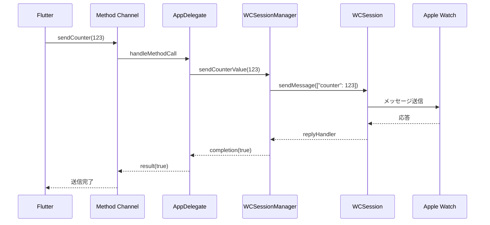
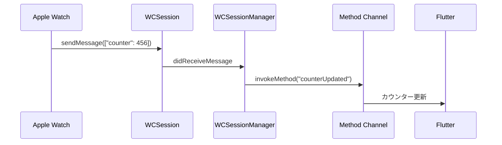

# iOS 実装詳細

iOS 側の実装について詳しく解説します。Flutter アプリと Apple Watch 間の橋渡し役として、Method Channel と WatchConnectivity を統合した実装を行っています。

## 📁 ファイル構成

```
ios/Runner/
├── AppDelegate.swift              # Flutter統合とMethod Channel管理
├── WCSessionManager.swift         # WatchConnectivity管理
├── Info.plist                    # アプリ設定
├── Runner-Bridging-Header.h       # Swift-Objective-C ブリッジ
└── GeneratedPluginRegistrant.h/m  # Flutter生成ファイル
```

## 🎯 主要コンポーネント

### 1. AppDelegate (`AppDelegate.swift`)

Flutter アプリケーションのメインエントリーポイントであり、Method Channel と WCSessionManager の統合を行います。

```swift
import Flutter
import UIKit
import WatchConnectivity

@main
@objc class AppDelegate: FlutterAppDelegate {
  private var wcSessionManager: WCSessionManager?

  override func application(
    _ application: UIApplication,
    didFinishLaunchingWithOptions launchOptions: [UIApplication.LaunchOptionsKey: Any]?
  ) -> Bool {

    let controller : FlutterViewController = window?.rootViewController as! FlutterViewController
    let counterChannel = FlutterMethodChannel(name: "flutter_watch/counter",
                                              binaryMessenger: controller.binaryMessenger)

    wcSessionManager = WCSessionManager(methodChannel: counterChannel)

    counterChannel.setMethodCallHandler { [weak self] (call: FlutterMethodCall, result: @escaping FlutterResult) in
      self?.handleMethodCall(call: call, result: result)
    }

    GeneratedPluginRegistrant.register(with: self)
    return super.application(application, didFinishLaunchingWithOptions: launchOptions)
  }
}
```

**ポイント:**

- `FlutterMethodChannel`で Flutter↔iOS の通信チャネル確立
- `WCSessionManager`のインスタンス作成と初期化
- Method Call のハンドリング設定

### 2. Method Call 処理

```swift
private func handleMethodCall(call: FlutterMethodCall, result: @escaping FlutterResult) {
  switch call.method {
  case "initializeSession":
    wcSessionManager?.initializeSession { success, statusKey in
      DispatchQueue.main.async {
        result(["status_key": statusKey])
      }
    }

  case "sendCounter":
    guard let args = call.arguments as? [String: Any],
          let counter = args["counter"] as? Int else {
      result(FlutterError(code: "INVALID_ARGUMENT", message: "Invalid counter value", details: nil))
      return
    }

    wcSessionManager?.sendCounterValue(counter) { success in
      DispatchQueue.main.async {
        result(success)
      }
    }

  default:
    result(FlutterMethodNotImplemented)
  }
}
```

**処理内容:**

1. **initializeSession**: WatchConnectivity セッションの初期化
2. **sendCounter**: Apple Watch へのカウンター値送信
3. **エラーハンドリング**: 不正な引数や未実装メソッドの処理

## 🔗 WCSessionManager (`WCSessionManager.swift`)

WatchConnectivity フレームワークを管理する核となるクラスです。

### クラス構造

```swift
import WatchConnectivity

class WCSessionManager: NSObject {
    private let methodChannel: FlutterMethodChannel
    private var wcSession: WCSession?

    init(methodChannel: FlutterMethodChannel) {
        self.methodChannel = methodChannel
        super.init()
    }
}
```

### 1. セッション初期化

```swift
func initializeSession(completion: @escaping (Bool, String) -> Void) {
    guard WCSession.isSupported() else {
        completion(false, "WCSession is not supported")
        return
    }

    wcSession = WCSession.default
    wcSession?.delegate = self
    wcSession?.activate()

    DispatchQueue.main.asyncAfter(deadline: .now() + 1.0) { [weak self] in
        guard let session = self?.wcSession else {
            completion(false, "Session is nil after activation")
            return
        }

        let status = self?.getSessionStatus(session) ?? "Error"
        completion(session.isReachable, status)
    }
}
```

**処理フロー:**

1. WCSession のサポート確認
2. デフォルトセッションの取得
3. デリゲート設定
4. セッションのアクティベート
5. 初期化完了後の状態確認

### 2. セッション状態判定

```swift
private func getSessionStatus(_ session: WCSession) -> String {
    if !session.isPaired {
        return "not_paired"
    } else if !session.isWatchAppInstalled {
        return "not_installed"
    } else if !session.isReachable {
        return "not_reachable"
    } else {
        return "connected"
    }
}
```

**状態の種類:**

- `not_paired`: Apple Watch がペアリングされていない
- `not_installed`: Watch 用アプリがインストールされていない
- `not_reachable`: Apple Watch と通信できない
- `connected`: 正常に接続済み

### 3. メッセージ送信

```swift
func sendCounterValue(_ counter: Int, completion: @escaping (Bool) -> Void) {
    guard let session = wcSession else {
        completion(false)
        return
    }

    guard session.isReachable else {
        completion(false)
        return
    }

    let message = ["counter": counter]
    session.sendMessage(message, replyHandler: { response in
        completion(true)
    }, errorHandler: { error in
        completion(false)
    })
}
```

**送信プロセス:**

1. セッションの有効性確認
2. 到達可能性の確認
3. `sendMessage`で Apple Watch にデータ送信
4. 成功/失敗のコールバック処理

## 🎭 WCSessionDelegate 実装

### 1. セッション状態変更の監視

```swift
extension WCSessionManager: WCSessionDelegate {
    func session(_ session: WCSession, activationDidCompleteWith activationState: WCSessionActivationState, error: Error?) {
        DispatchQueue.main.async { [weak self] in
            var status: String

            if let error = error {
                status = "error"
            } else {
                switch activationState {
                case .activated:
                    status = self?.getSessionStatus(session) ?? "error"
                case .inactive:
                    status = "not_reachable"
                case .notActivated:
                    status = "connecting"
                @unknown default:
                    status = "error"
                }
            }

            self?.methodChannel.invokeMethod("sessionStateChanged",
                                           arguments: ["status_key": status])
        }
    }
}
```

**状態遷移の処理:**

- セッション有効化完了時の状態判定
- エラー発生時の適切な状態設定
- Flutter 側への状態変更通知

### 2. 接続状態変更の監視

```swift
func sessionDidBecomeInactive(_ session: WCSession) {
    DispatchQueue.main.async { [weak self] in
        self?.methodChannel.invokeMethod("sessionStateChanged",
                                       arguments: ["status_key": "not_reachable"])
    }
}

func sessionDidDeactivate(_ session: WCSession) {
    DispatchQueue.main.async { [weak self] in
        self?.methodChannel.invokeMethod("sessionStateChanged",
                                       arguments: ["status_key": "error"])
    }
}
```

### 3. メッセージ受信処理

```swift
func session(_ session: WCSession, didReceiveMessage message: [String : Any]) {
    DispatchQueue.main.async { [weak self] in
        if let counter = message["counter"] as? Int {
            self?.methodChannel.invokeMethod("counterUpdated",
                                           arguments: ["counter": counter])
        }
    }
}

func session(_ session: WCSession, didReceiveMessage message: [String : Any], replyHandler: @escaping ([String : Any]) -> Void) {
    DispatchQueue.main.async { [weak self] in
        if let counter = message["counter"] as? Int {
            self?.methodChannel.invokeMethod("counterUpdated",
                                           arguments: ["counter": counter])
        }

        let reply = ["status": "received"] as [String : Any]
        replyHandler(reply)
    }
}
```

**メッセージ受信の処理:**

1. Apple Watch からのカウンター値受信
2. Flutter 側への値転送
3. 応答が必要な場合の reply 送信

## 🔄 通信フロー詳細

### Flutter → Apple Watch



### Apple Watch → Flutter



## 🛡️ エラーハンドリング

### 1. セッション初期化エラー

```swift
guard WCSession.isSupported() else {
    completion(false, "WCSession is not supported")
    return
}
```

### 2. 送信エラー

```swift
session.sendMessage(message, replyHandler: { response in
    completion(true)
}, errorHandler: { error in
    completion(false)  // エラー時はfalseを返す
})
```

### 3. 引数検証エラー

```swift
guard let args = call.arguments as? [String: Any],
      let counter = args["counter"] as? Int else {
  result(FlutterError(code: "INVALID_ARGUMENT",
                     message: "Invalid counter value",
                     details: nil))
  return
}
```

## 🔧 設定とベストプラクティス

### 1. Info.plist 設定

WatchConnectivity を使用するための設定：

```xml
<key>WKCompanionAppBundleIdentifier</key>
<string>com.example.flutterWatch</string>
```

### 2. メモリ管理

```swift
// weak selfでメモリリークを防止
DispatchQueue.main.async { [weak self] in
    self?.methodChannel.invokeMethod(...)
}
```

### 3. スレッド安全性

```swift
// UIスレッドでMethod Channel呼び出し
DispatchQueue.main.async {
    self?.methodChannel.invokeMethod(...)
}
```

### 4. リソース管理

```swift
// セッションの適切な初期化と解放
wcSession = WCSession.default
wcSession?.delegate = self
wcSession?.activate()
```

## 🧪 デバッグとテスト

### 1. ログ出力

```swift
print("🍎 iOS received method call: \(call.method)")
print("🍎 Sending counter to Watch: \(counter)")
print("🍎 Session state: \(session.activationState.rawValue)")
```

### 2. 状態確認

```swift
print("🍎 Session state check:")
print("🍎 - isReachable: \(session.isReachable)")
print("🍎 - isPaired: \(session.isPaired)")
print("🍎 - isWatchAppInstalled: \(session.isWatchAppInstalled)")
```

### 3. エラー処理

```swift
if let error = error {
    print("🍎 Session activation error: \(error.localizedDescription)")
}
```

## ⚠️ 注意点

### 1. セッション初期化タイミング

- WCSession の初期化は非同期で行われる
- 初期化完了前の操作は失敗する可能性がある

### 2. 到達可能性の確認

- `isReachable`の確認は必須
- Apple Watch が起動していない場合は通信不可

### 3. メモリ使用量

- 大量のデータ送信は避ける
- 必要最小限のデータのみ送信

### 4. バッテリー効率

- 頻繁な通信は避ける
- 必要な時のみ通信を行う
