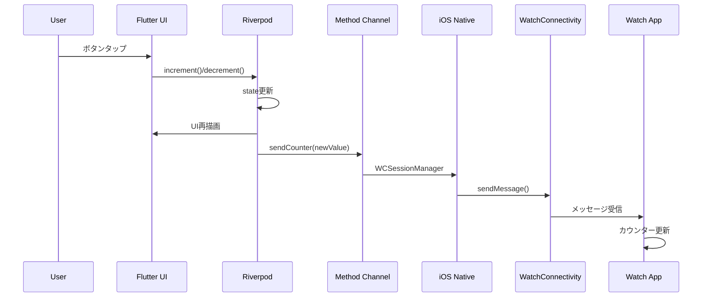
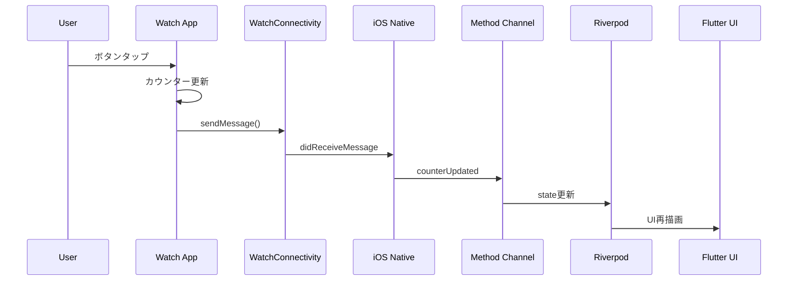

# アーキテクチャ概要

## 🏗️ システム全体構成

本プロジェクトは 3 つの主要コンポーネントで構成されています：

1. **Flutter Application** - メインのモバイルアプリ
2. **iOS Native Layer** - Flutter と WatchConnectivity の橋渡し
3. **watchOS Application** - Apple Watch 上で動作するアプリ

```
┌─────────────────┐    ┌─────────────────┐    ┌─────────────────┐
│  Flutter App    │    │  iOS Native     │    │  watchOS App    │
│                 │    │                 │    │                 │
│  ┌────────────┐ │    │  ┌────────────┐ │    │  ┌────────────┐ │
│  │ Riverpod   │ │    │  │WCSession   │ │    │  │ SwiftUI    │ │
│  │ Providers  │ │    │  │Manager     │ │◄──►│  │ Views      │ │
│  └────────────┘ │    │  └────────────┘ │    │  └────────────┘ │
│         ▲       │    │         ▲       │    │         ▲       │
│         │       │    │         │       │    │         │       │
│  ┌────────────┐ │    │  ┌────────────┐ │    │  ┌────────────┐ │
│  │Method      │ │◄──►│  │AppDelegate │ │    │  │Watch       │ │
│  │Channel     │ │    │  │            │ │    │  │Session     │ │
│  └────────────┘ │    │  └────────────┘ │    │  │Manager     │ │
└─────────────────┘    └─────────────────┘    │  └────────────┘ │
                                              └─────────────────┘
```

## 🎯 設計思想

### 1. 関心の分離（Separation of Concerns）

各レイヤーが明確な責任を持ちます：

- **Flutter Layer**: UI 表示と状態管理
- **iOS Native Layer**: プラットフォーム固有の通信処理
- **watchOS Layer**: Watch 専用の UI 体験

### 2. 疎結合設計

各コンポーネント間は標準化されたインターフェースで通信：

- **Method Channel**: Flutter ↔ iOS 間の通信
- **WatchConnectivity**: iOS ↔ watchOS 間の通信

### 3. リアクティブ設計

状態変更が自動的に全体に伝播する仕組み：

```
User Action → State Update → UI Reflection → Cross-platform Sync
```

## 📊 データフロー

### iPhone → Apple Watch



### Apple Watch → iPhone



## 🏛️ アーキテクチャパターン

### Flutter 側: MVVM + Riverpod

```dart
// View (UI)
class CounterPage extends HookConsumerWidget {
  // ...
}

// ViewModel (Provider)
@riverpod
class Counter extends _$Counter {
  // State management logic
}

// Model (Data)
enum WatchConnectionStatus {
  connecting, connected, error, // ...
}
```

### iOS 側: Coordinator Pattern

```swift
// Coordinator (AppDelegate)
class AppDelegate: FlutterAppDelegate {
  // Method Channel coordination
}

// Service (WCSessionManager)
class WCSessionManager: NSObject, WCSessionDelegate {
  // WatchConnectivity business logic
}
```

### watchOS 側: MVVM + ObservableObject

```swift
// View
struct ContentView: View {
  @EnvironmentObject var sessionManager: WatchSessionManager
  // ...
}

// ViewModel
class WatchSessionManager: NSObject, ObservableObject {
  @Published var counter: Int = 0
  @Published var isConnected: Bool = false
  // ...
}
```

## 🔧 技術選択の理由

### Riverpod + riverpod_generator

**選択理由:**

- 型安全な状態管理
- コード生成による開発効率向上
- 依存性注入の簡易化

**メリット:**

- コンパイル時エラー検出
- ボイラープレートコード削減
- テスタビリティ向上

### Method Channel

**選択理由:**

- Flutter 標準の通信方式
- 双方向通信サポート
- 型安全な通信

**メリット:**

- 高いパフォーマンス
- Flutter エコシステムとの親和性
- 豊富なドキュメント

### WatchConnectivity

**選択理由:**

- Apple 公式フレームワーク
- リアルタイム通信対応
- 省電力設計

**メリット:**

- 高い信頼性
- バッテリー効率
- Apple Watch との深い統合

## 🎨 UI/UX 設計

### シンプル志向

記事の読者が理解しやすいよう、UI は意図的にシンプルに設計：

- **最小限の要素**: カウンター表示、+/-ボタン、接続状態
- **統一感のあるデザイン**: iPhone、Apple Watch 間で一貫性を保持
- **明確なフィードバック**: 操作結果と接続状態を即座に表示

### レスポンシブ通信

- **即座の反映**: ローカル更新後にリモート同期
- **エラーハンドリング**: 通信失敗時のロールバック機能
- **接続状態表示**: リアルタイムな接続ステータス

## 🧪 テスト戦略

### 単体テスト

- Riverpod プロバイダーのロジック
- Method Channel の通信処理
- WCSession の状態管理

### 統合テスト

- Flutter → iOS → watchOS のエンドツーエンド通信
- エラーケースでの挙動確認
- 接続状態変更時の処理確認

### 手動テスト

- 実機での動作確認
- 複数シナリオでの検証
- パフォーマンス測定
